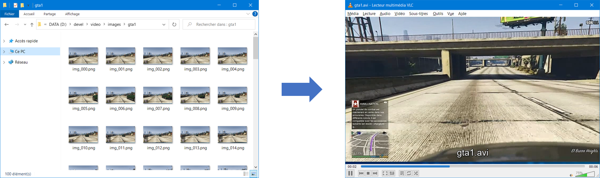

# 🎥 Video Processing 🎬

1. Images 2 video
2. Video 2 images

## 1. Images 2 video

## 2. Video 2 Images

## Resources

- [Getting Started with Videos - OpenCV-Python Tutorials](https://opencv-python-tutroals.readthedocs.io/en/latest/py_tutorials/py_gui/py_video_display/py_video_display.html)
- [Creating Video from Images using OpenCV-Python](https://theailearner.com/2018/10/15/creating-video-from-images-using-opencv-python/)
- [Convert Video to Images (Frames) & Images (Frames) to Video using OpenCV (Python)](https://medium.com/@iKhushPatel/convert-video-to-images-images-to-video-using-opencv-python-db27a128a481)